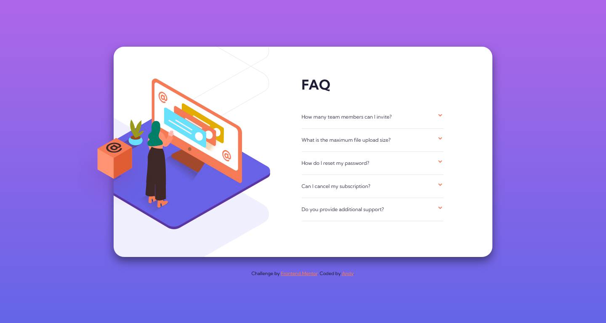
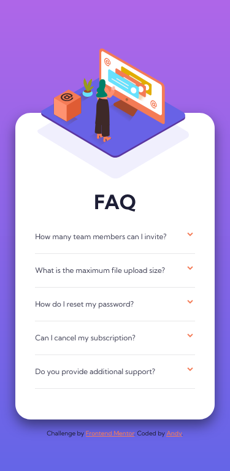

# Frontend Mentor - FAQ accordion card solution

This is a solution to the [FAQ accordion card challenge on Frontend Mentor](https://www.frontendmentor.io/challenges/faq-accordion-card-XlyjD0Oam). Frontend Mentor challenges help you improve your coding skills by building realistic projects.

## Table of contents

- [Overview](#overview)
  - [The challenge](#the-challenge)
  - [Screenshot](#screenshot)
  - [Links](#links)
- [My process](#my-process)
  - [Built with](#built-with)
- [Author](#author)

## Overview

This is my seventh challenge from [Front-end-mentor.io](https://www.frontendmentor.io/). It was to code and style a FAQ accordion card based on the design assets provided. I chose not to use Javascript for the challenge in this version. (static **JPG** images)

### The challenge

Users should be able to:

- View the optimal layout for the component depending on their device's screen size
- See hover states for all interactive elements on the page
- Hide/Show the answer to a question when the question is clicked
- **BONUS** Complete the challenge without using JavaScript

### Screenshot

### Links

- Solution URL: [Github Repo](https://github.com/AndyAshley/Accordion-FAQ-CSS)
- Live Site URL: [GitHub Pages](https://andyashley.github.io/Accordion-FAQ-CSS/)

## My process

I decided to try the bonus challenge of not using any javascript, so i became a little more familiar with radio buttons lol.

### Built with

- Semantic HTML5 markup
- CSS custom properties
- CSS Animations
- Flexbox
- Mobile-first workflow

## Author

- Frontend Mentor - [@Andy](https://www.frontendmentor.io/profile/AndyAshley)
# Accordion-FAQ-CSS
